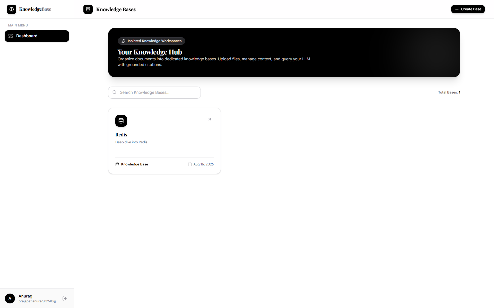
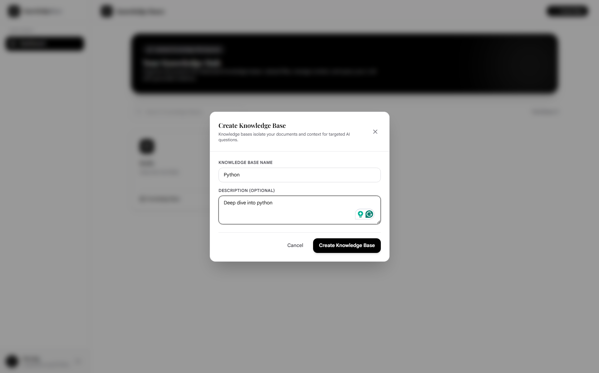
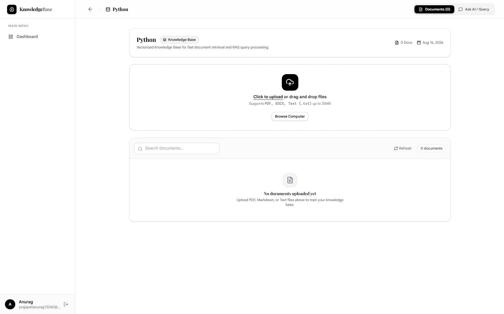
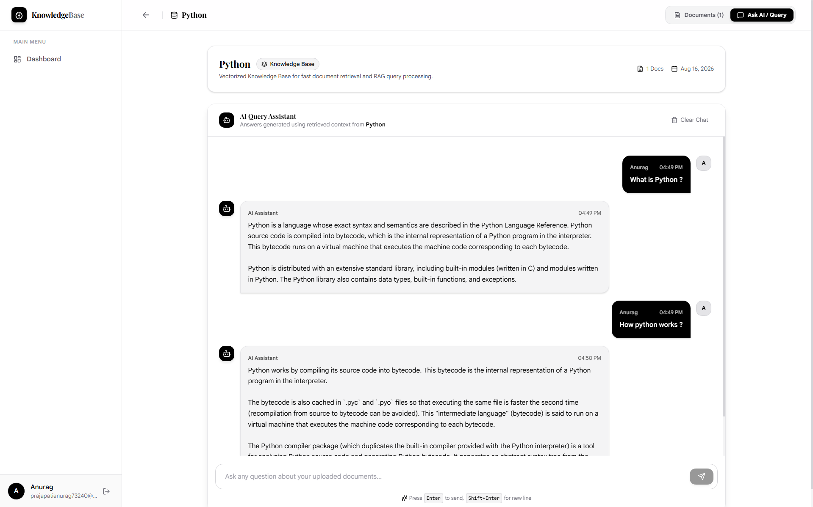
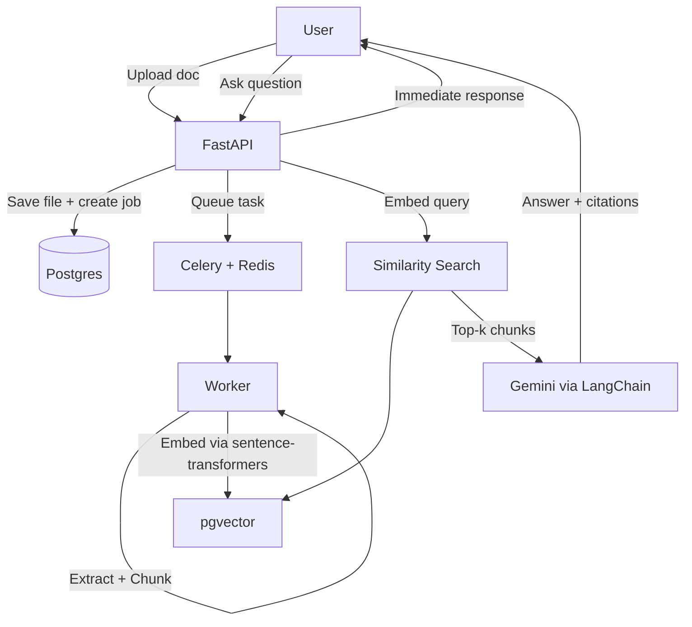

<div align="center">


# Personal Knowledge RAG API

**Personal Knowledge is a platform where users can upload their personal documents, notes, and PDFs into separate knowledge bases and then ask questions about them**


</div>

---

## 📸 Preview

### 📚 List Knowledge Bases
List Knowledge Bases: Displays all knowledge bases that have been created.



### 📚 Create Knowledge Base
Create isolated, per-user knowledge bases to organize documents by topic.



### 📄 Document Upload
Upload PDF/MD/TXT files processed asynchronously in the background.



### 💬 Ask Questions
Query your documents in a chat interface.



---

## 🏗️ Architecture



### Key Architectural Decisions

| Decision | Choice | Reasoning |
|---|---|---|
| Sync vs async ingestion | Async (Celery) | Embedding generation is slow — API response must not block on it |
| Vector storage | pgvector (not a dedicated vector DB) | One database instead of two; direct SQL joins between chunks and documents/KBs; sufficient performance at this scale |
| LLM/embedding abstraction | LangChain | Swappable providers (Gemini → OpenAI/Claude) without rewriting the service layer |
| Chunk isolation | `kb_id` denormalized onto `chunks` | Fast filtered vector search without an extra join on every query |
| Worker DB access | Fresh async engine per task | asyncpg connections can't cross event loops — Celery's `asyncio.run()` per task requires a scoped engine, not a shared one |
| Auth | Stateless JWT | No session store needed; scales cleanly with async workers |

---

## ✨ Features

| Feature | What's built |
|---|---|
| **Multi-tenant knowledge bases** | Every KB, document, and chunk is scoped to `user_id` — enforced at the query level, not just the UI |
| **Async ingestion pipeline** | Celery + Redis pipeline: extract → chunk → embed → store, without blocking the upload request |
| **Semantic search** | pgvector cosine-similarity search, filtered per knowledge base |
| **RAG-based Q&A** | Retrieved chunks are injected into a grounded prompt — Gemini is explicitly instructed not to answer outside the given context |
| **Source citations** | Every answer returns the document name and chunk index it was generated from |
| **Document status tracking** | `uploaded → processing → completed/failed`, with error messages surfaced on failure |
| **JWT authentication** | Stateless auth, per-user resource isolation enforced across every KB/document/query endpoint |

---

## 🛠️ Tech Stack

### Backend

| Technology | Purpose | Why chosen |
|---|---|---|
| FastAPI | HTTP framework | Async-native, automatic OpenAPI docs, Pydantic-based validation |
| SQLAlchemy 2.0 (async) | ORM | Async-first, modern `select()` API, type-safe with `Mapped[]` |
| PostgreSQL + pgvector | Database + vector store | One database for relational data and vector search — no separate vector DB to sync |
| Alembic | Migrations | Schema versioning, autogenerate diffing against models |
| Celery + Redis | Background jobs | Standard async task queue; decouples slow embedding work from the request/response cycle |
| LangChain | LLM/embedding abstraction | Common interface across providers — swapping Gemini for another LLM is a config change, not a rewrite |
| Google Gemini | Answer generation | Fast, cost-effective for RAG-style grounded Q&A |
| sentence-transformers | Local embeddings | Runs on CPU, no per-call API cost for embedding generation |
| JWT (python-jose) + bcrypt | Authentication | Stateless auth, one-way password hashing |
| uv | Package management | Fast, reproducible installs via lockfile |

### Frontend

| Technology | Purpose | Why chosen |
|---|---|---|
| React + TypeScript | UI framework | Type-safe components and API responses |
| Vite | Build tool | Fast dev server, native ESM |
| Tailwind CSS | Styling | Utility-first, no separate CSS files |
| React Context API | Global state | Auth state and active KB — no external state library needed at this scale |
| Axios | HTTP client | Interceptors for JWT attachment and centralized error handling |
| React Router | Navigation | Protected routes, nested layouts |

### Infrastructure

| Service | What runs there |
|---|---|
| Docker Compose | Local orchestration — API, worker, Postgres, Redis |
| Supabase / Neon | Hosted Postgres + pgvector |
| Upstash | Hosted Redis (Celery broker) |
| Render / Railway | FastAPI + Celery worker |
| Vercel | React frontend |

---

## Running Locally

```bash
git clone <repo-url>
cd backend
cp .env.example .env.docker   # fill in GEMINI_API_KEY and other values
docker compose up --build
docker compose exec api alembic upgrade head
```

API at `http://localhost:8000`, docs at `http://localhost:8000/docs`.

```bash
cd frontend
npm install
npm run dev
```

Frontend at `http://localhost:5173`.

---

## 👤 Author

**Anurag Prajapati**
Backend Developer

[](https://github.com/anurag-prajapati34)
[](https://linkedin.com/in/anurag-prajapati34)
[](https://anuragdev.com/)

---
